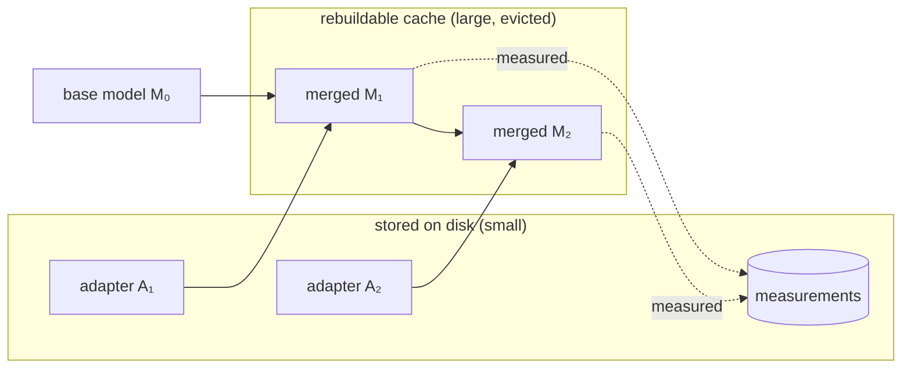
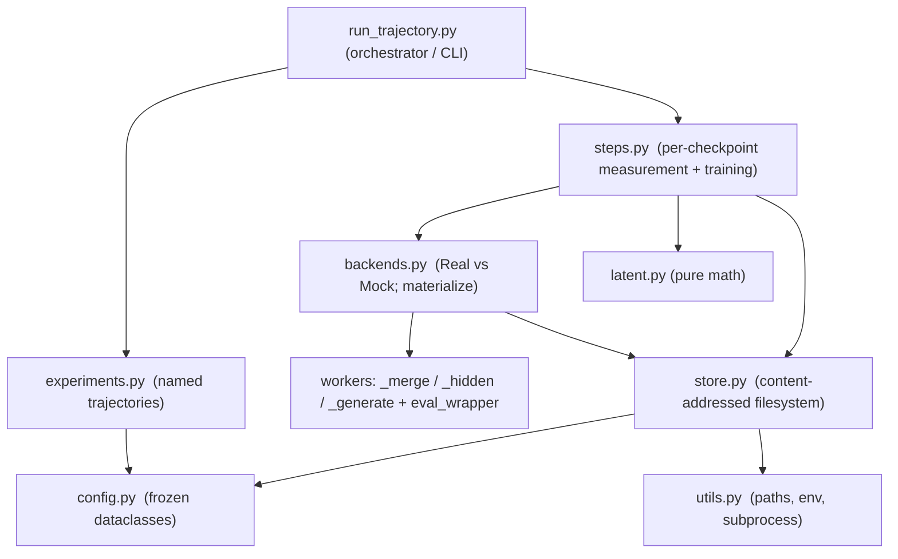
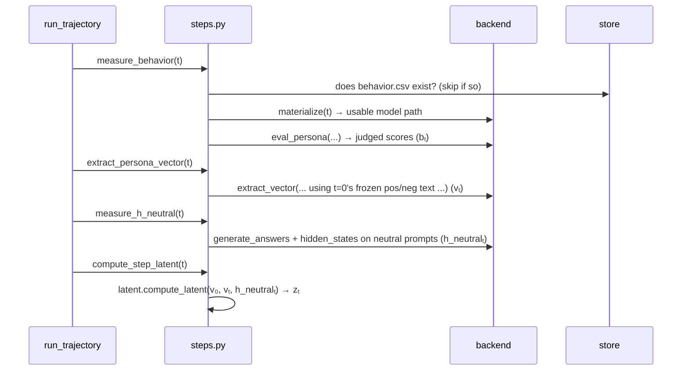

# A Tutorial for the `method/` Pipeline

This document explains the code under [`method/`](../method) — what it is trying to
measure, the mental model behind it, and how the many small files fit together.
Read it top to bottom the first time; afterwards the **File-by-file reference**
and **Glossary** at the end work as lookups.

> Everything under [`method/persona_vectors/`](../method/persona_vectors) is
> *vendored* third-party code (from the
> [persona_vectors](https://github.com/safety-research/persona_vectors) repo) and
> is never edited. Our code *wraps* it. That single constraint explains a lot of
> the design, so keep it in mind.

---

## Part 1 — What is this pipeline actually doing?

### The scientific question

A **persona vector** is a direction in a language model's activation space that
corresponds to a behavioural trait — "evil", "sycophantic", "hallucinating".
Move the model's internal state along that direction and the trait shows up in
its outputs.

This project studies what happens to that direction when you **fine-tune a model
several times in a row**. For example:

```
base model  →  fine-tune on a "misaligned" dataset  →  fine-tune on a "normal" dataset
   M₀                        M₁                                    M₂
```

Does step 1 push the model along the "evil" direction? Does step 2 pull it back?
Does the *direction itself* rotate or fade as we train? To answer this we take a
battery of **measurements at every checkpoint** `M₀, M₁, M₂, …` and watch how
they evolve.

### The vocabulary

| Term | Meaning |
|------|---------|
| **Trajectory** | One full experiment: a base model plus an ordered list of fine-tuning **steps**. |
| **Step** | One fine-tuning event — a dataset plus the hyper-parameters to train on it. |
| **Checkpoint `Mₜ`** | The model after `t` steps. `M₀` is the untouched base model. |
| **Persona vector `vₜ`** | The trait direction, re-extracted at checkpoint `t`. |
| **Latent state `zₜ`** | Four scalars summarising where `Mₜ` sits relative to the trait axis (see Part 3). |

The whole pipeline is: **for each checkpoint, produce measurements; between
checkpoints, fine-tune to the next one.**

---

## Part 2 — The mental model

Two ideas carry the entire architecture. If you understand these, the rest is
detail.

### Idea 1: Every artifact is named by the *recipe* that produces it

Instead of naming files by run number or timestamp, we hash the **recipe** — the
exact base model, trait, seed, and the list of steps taken so far — into a short
id called `weights_id`:

```
get_weights_id(cfg, t) = "t{t}-{first 16 hex chars of sha256(recipe up to step t)}"
```

for example `t02-9f3c1a...`. This is defined in
[`store.py`](../method/store.py) and built from
[`TrajectoryConfig.weights_key`](../method/config.py) in
[`config.py`](../method/config.py).

Why this matters: **two trajectories that share a prefix produce identical ids
for that prefix.** If experiment A and experiment B both start with the same
"make it evil" step, they compute the *same* `weights_id` for that checkpoint and
therefore **share its adapter and all its measurements for free** — no
recomputation. And a run that crashed halfway resumes simply by being
re-invoked: each stage checks "does my output file already exist?" and skips if
so.

> Crucially, `weights_key` includes only things that change the **weights**
> (model, trait, seed, steps). It deliberately *excludes* measurement settings
> like the judge model — so re-scoring a checkpoint with a different judge does
> **not** force you to retrain it.

### Idea 2: Store small, rebuild big

Fine-tuning here uses **LoRA adapters** — small (~tens of MB) diffs against a
base model — rather than full fine-tunes. A checkpoint is reconstructed by
*merging* adapters onto the base in order:

```
M₀ ──merge A₁──▶ M₁ ──merge A₂──▶ M₂ ──merge A₃──▶ M₃
```

So the pipeline stores only two kinds of **durable, small** things:

- **adapters** — one LoRA adapter per step (how to get from `Mₜ₋₁` to `Mₜ`)
- **measurements** — the numbers we actually care about

The **full merged weights** (multiple GB) are treated as a **disposable cache**:
they can always be rebuilt by replaying the adapter chain, so they are deleted
when no longer needed. This replay is *exact*, not an approximation, because
adapter `t+1` was literally trained on top of the merged result of adapter `t`.
(That assumption — that you can train a fresh adapter on a merged checkpoint — is
the one thing [`tests/test_chaining.py`](../tests/test_chaining.py) exists to
prove.)



---

## Part 3 — The five quantities we measure

At each checkpoint the pipeline produces five things. Four of them feed the
**latent state `zₜ`**; the fifth (`ΔP`) describes the *upcoming* training step.
The pure math for all of these lives in [`latent.py`](../method/latent.py) and is
unit-tested in [`tests/test_latent.py`](../tests/test_latent.py).

First, one building block — the **scalar projection** of an activation `h` onto a
direction `v`:

```
project(h, v) = (h · v) / ‖v‖
```

It measures *how far along* the direction `v` the activation `h` reaches. Note it
divides by the length of `v` (so rescaling the direction doesn't matter) but
**not** by the length of `h` (so if the activation grows, the projection grows —
that is intentional).

Now the five quantities:

| Symbol | Name | Definition | What it tells you |
|--------|------|-----------|-------------------|
| **`bₜ`** | behaviour | judge scores on eval questions | Does `Mₜ` *act* evil/sycophantic/…? (the ground-truth outcome) |
| **`vₜ`** | persona vector | extracted trait direction at step `t` | The trait axis itself |
| **`h_neutralₜ`** | neutral activations | mean activation over a fixed neutral prompt set | Where the model's "resting" internal state sits |
| **`zₜ`** | latent state | `(p, q, ρ, r)` — see below | A 4-number summary of drift |
| **`ΔP`** | projection difference | per-example shift the *next* dataset asks for | How hard the upcoming step pushes along the trait axis |

The **latent state** `zₜ = (p, q, ρ, r)` combines `v₀`, `vₜ` and `h_neutralₜ`:

```
p  = project(h_neutralₜ, v₀)   drift of the neutral state along the ORIGINAL axis
q  = project(h_neutralₜ, vₜ)   drift along the CURRENT (possibly rotated) axis
ρ  = cos(v₀, vₜ)            how far the persona vector has ROTATED since step 0
r  = ‖vₜ‖                   whether the persona vector FADED or STRENGTHENED
```

`p` and `q` differ only if the axis rotated (`ρ < 1`); comparing them separates
"the model moved along the trait" from "the trait direction itself moved."

And `ΔP` for a training example is the shift it demands along the current axis:

```
ΔP_i = project(h_targetᵢ, vₜ) − project(h_predᵢ, vₜ)
```

where `h_target` is the activation on the dataset's *target* answer and `h_pred`
is the activation on `M₀`'s *own* answer to the same prompt.

---

## Part 4 — The architecture, in layers

The files stack into layers. Higher layers depend only on lower ones.



- **`config.py` / `utils.py`** — foundation: what a trajectory *is*, and where
  files live.
- **`store.py`** — the content-addressed filesystem (Idea 1 + Idea 2).
- **`latent.py`** — the pure math (Part 3), no models, no I/O.
- **`backends.py`** — the abstraction that lets the exact same orchestration run
  either **for real** (loading models) or **mock** (fake artifacts, no GPU).
- **workers** — small standalone scripts each run as their own **subprocess**, so
  only one model is ever resident on the GPU at a time.
- **`steps.py`** — glues store + backend + math into resumable per-checkpoint
  operations.
- **`experiments.py` / `run_trajectory.py`** — the named experiments and the loop
  that drives them.

---

## Part 5 — A guided walkthrough

Let's follow a real command from top to bottom:

```bash
poetry run python -m method.run_trajectory --config SMOKE_MOCK
```

`SMOKE_MOCK` (defined in [`experiments.py`](../method/experiments.py)) is a
2-step trajectory — step 1 pushes the model toward a trait, step 2 is a "normal"
dataset that may re-align it — run on the **mock** backend, so **no model is
loaded at all**: fake artifacts with correct shapes flow through the *real*
analysis code. This is how you test the whole pipeline on a laptop with no GPU.

### The main loop

[`run_trajectory.run`](../method/run_trajectory.py) does this:

```
for t in 0, 1 (each step index):
    measure_checkpoint(t)          # bₜ, vₜ, h_neutralₜ, zₜ
    train_file = sample the exact examples step t+1 will train on
    compute ΔP for that training file   # attributed to checkpoint t
    if adapter for step t+1 not already in the store:
        materialize(Mₜ) and train the adapter A_{t+1}; install it
measure_checkpoint(2)              # the final checkpoint, no ΔP after it
write trajectory.json; evict all merged weights
```

Notice the two-part rhythm: **measure the checkpoint**, then **compute the action
features (`ΔP`) for the step about to happen**, then **train**. `ΔP` describes an
*upcoming* update, so it is attributed to the checkpoint that precedes it.

### Zooming into `measure_checkpoint(t)`

From [`run_trajectory.measure_checkpoint`](../method/run_trajectory.py), which
calls into [`steps.py`](../method/steps.py):



Every one of these functions first checks whether its output artifact already
exists and returns early if so — that is what makes the whole run **idempotent
and resumable**.

### What `materialize` does

When a step needs an actual model path,
[`backends.materialize`](../method/backends.py) provides one:

- `t == 0` → just return the base model's Hub id (nothing is copied).
- otherwise → find the deepest already-merged checkpoint, then replay the adapter
  chain forward onto disk, **evicting each intermediate** as it goes, so at most
  two full checkpoints exist at once.

Under the **mock** backend, `materialize` still runs, but `backend.merge` just
writes a tiny placeholder `config.json` instead of gigabytes of weights.

### The two backends

This is the key abstraction in [`backends.py`](../method/backends.py). Both
implement the same interface (`merge`, `train`, `eval_persona`,
`extract_vector`, `hidden_states`, `generate_answers`):

- **`RealBackend`** shells out to the vendored scripts / our workers, **one
  subprocess per operation**. Subprocesses guarantee only one model is on the GPU
  at a time — each process exits and frees its memory before the next starts.
- **`MockBackend`** writes **structurally faithful** fake artifacts: right file
  names, right tensor shapes (e.g. `[25, 896]` for Qwen2.5-0.5B), values seeded
  deterministically by content. Because the shapes are correct, every downstream
  consumer — `zₜ`, `ΔP`, plots — runs its *real* code path on fake inputs.

To keep the two from contaminating each other,
[`Store.for_backend`](../method/store.py) roots the mock run in a **separate
`store-mock/` directory**. (Recall `weights_id` hashes only the recipe, not the
backend, so a mock and real run of the same trajectory collide on every id — the
separate root is what stops mock's fake adapters being mistaken for real cache
hits.)

### The workers

`RealBackend` doesn't load models itself; it launches these standalone
subprocesses:

- [`_merge_worker.py`](../method/_merge_worker.py) — merge one LoRA adapter into a
  base model on **CPU** (pure weight arithmetic; leaves the GPU free) and save a
  full checkpoint.
- [`_hidden_worker.py`](../method/_hidden_worker.py) — compute **response-averaged
  hidden states**. One worker serves *all three* activation measurements
  (`h_neutral`, and `ΔP`'s target and predicted terms) because they are the same
  operation on different text. Averaging over *response* tokens matches how the
  vendored `generate_vec.py` builds the persona vector, so activations and
  vectors live in the same space.
- [`_generate_worker.py`](../method/_generate_worker.py) — generate answers with
  **vLLM**, reusing the vendored loader. Used only twice per trajectory (`M₀`'s
  answers to neutral prompts, and to training prompts), then reused unchanged.
- [`eval_wrapper.py`](../method/eval_wrapper.py) — run the vendored
  `eval_persona`, but with a **swappable judge**. The vendored code hard-codes
  `OpenAiJudge`, so this monkey-patches the `judge` module *before* importing
  `eval_persona`, allowing a deterministic offline `StubJudge` for smoke runs
  (paying OpenAI to score throwaway 0.5B generations buys nothing).

---

## Part 6 — Design decisions, and *why*

These are the recurring patterns. Understanding the "why" makes the code read
much faster.

**Content addressing (hash the recipe).** Enables cross-experiment reuse and
crash-resume with no bookkeeping database. → `weights_id`, `weights_key`.

**Presence = completeness, via atomic writes.** Every artifact is written to a
scratch path and then `os.replace`d onto its final name (see
[`atomic_file` / `atomic_dir`](../method/store.py)). A rename is atomic, so a
half-written file never appears under its real name. That is why the resume
checks can simply ask "does this file exist?" — there is no separate manifest to
keep in sync. The [`_promote`](../method/steps.py) helper extends this to
multi-file steps by moving the "done" marker file **last**.

**Store small, rebuild big.** Adapters + measurements are durable; merged weights
are a cache. → `materialize`, `evict_merged`.

**One model on the GPU at a time.** Achieved by running each heavy operation as
its own subprocess that exits before the next begins. → the workers + `run_step`.

**Real vs Mock behind one interface.** Lets the orchestration, hashing, resume
and math all be exercised with no GPU. → `ExecutionBackend`.

**Freeze the reference text.** The persona vector is always re-extracted using
`M₀`'s pos/neg responses, and `ΔP`/`h_neutral` reuse `M₀`'s fixed answers. This
isolates *representation* drift from *behavioural* drift and avoids the
degenerate case where a drifted model can no longer produce usable text. → see
the docstrings in [`steps.py`](../method/steps.py) and the `HNeutralSource` enum in
[`config.py`](../method/config.py).

**Never edit the vendored code.** All the wrapping, subprocess launching, and
monkey-patching exists because [`method/persona_vectors/`](../method/persona_vectors)
is off-limits. This also dictated the local proxy model choice (Qwen2.5-0.5B, not
a smaller model) — the vendored vLLM loader hard-codes a 30000-token context, so
a model with a shorter window fails to load. See the comment block in
[`experiments.py`](../method/experiments.py).

---

## Part 7 — File-by-file reference

| File | Role |
|------|------|
| [`config.py`](../method/config.py) | Frozen dataclasses defining a trajectory; `weights_key` (the hashed recipe) and the tuning enums (`Backend`, `DeltaPMode`, `HNeutralSource`, …). |
| [`utils.py`](../method/utils.py) | Path constants, `.env` loading, env-var checks, the `run_step` subprocess wrapper. |
| [`store.py`](../method/store.py) | Content-addressed filesystem: `weights_id`, `Store`, atomic writes, `adapter_chain`. |
| [`latent.py`](../method/latent.py) | Pure math: `project`, `cosine`, `compute_latent` (`zₜ`), `delta_projection` (`ΔP`), `summarize`. |
| [`backends.py`](../method/backends.py) | `ExecutionBackend` interface + `RealBackend`/`MockBackend`; `materialize` (adapter-chain replay). |
| [`_merge_worker.py`](../method/_merge_worker.py) | Subprocess: merge a LoRA adapter into a base model (on CPU). |
| [`_hidden_worker.py`](../method/_hidden_worker.py) | Subprocess: response-averaged hidden states for `h_neutral` and both `ΔP` terms. |
| [`_generate_worker.py`](../method/_generate_worker.py) | Subprocess: vLLM answer generation (neutral + training prompts). |
| [`eval_wrapper.py`](../method/eval_wrapper.py) | Runs vendored `eval_persona` with a swappable (`StubJudge`) judge. |
| [`steps.py`](../method/steps.py) | Resumable per-checkpoint ops: `measure_behavior`, `extract_persona_vector`, `measure_h_neutral`, `compute_step_latent`, `compute_delta_p`. |
| [`run_trajectory.py`](../method/run_trajectory.py) | The orchestrator / CLI; the measure→ΔP→train loop. |
| [`experiments.py`](../method/experiments.py) | Named trajectory configs (`SMOKE_MOCK`, `SMOKE_TINY`, `EXP1`) in a `REGISTRY`. |
| [`prep_neutral_prompts.py`](../method/prep_neutral_prompts.py) | Builds the fixed neutral probe set `h_neutral` is measured over (LMSYS or an offline set). |

---

## Part 8 — Running things

```bash
# 0. One-time: build the neutral probe set h_neutral is measured against.
poetry run python -m method.prep_neutral_prompts --local 32   # offline set
poetry run python -m method.prep_neutral_prompts              # LMSYS, 500 prompts

# 1. Mock run — no model, exercises all orchestration + math on a laptop.
poetry run python -m method.run_trajectory --config SMOKE_MOCK

# 2. Tiny real run — real vLLM/unsloth/merges on a small GPU, stubbed judge.
poetry run python -m method.run_trajectory --config SMOKE_TINY

# 3. Paper-scale run on the rental GPU (override the seed as needed).
poetry run python -m method.run_trajectory --config EXP1 --seed 3

# Unit-test the pure math.
.venv/bin/python -m pytest tests/test_latent.py -q
```

**Outputs land in two places:** measurements go into the content-addressed
`store/` (or `store-mock/`), keyed by checkpoint so they are shared across runs;
the per-run `trajectories/<name>_seed<n>/` directory records which checkpoints a
trajectory visited and the final `trajectory.json` summary.

### To add a new experiment

Add a `TrajectoryConfig` constant in
[`experiments.py`](../method/experiments.py) and register it in `REGISTRY`.
Because configs are plain Python, you can build them by composition
(`dataclasses.replace`, comprehensions over seeds) rather than templating YAML.

---

## Glossary

- **LoRA adapter** — a small, low-rank weight diff produced by fine-tuning;
  merging it into a base model yields the fine-tuned model.
- **`weights_id`** — short hash naming a checkpoint by its recipe; the key
  everything in the store is filed under.
- **materialize** — reconstruct a checkpoint's full weights by replaying its
  adapter chain onto the base model.
- **persona vector `vₜ`** — the extracted trait direction in activation space at
  checkpoint `t`.
- **`h_neutral`** — mean activation of a checkpoint over a fixed set of *neutral*
  prompts (neutral so as not to contaminate the measurement with the trait axis).
- **latent state `zₜ = (p, q, ρ, r)`** — drift on the original axis, drift on the
  current axis, rotation of the vector, and magnitude of the vector.
- **`ΔP`** — projection difference; how far a training example pushes the model
  along the persona direction.
- **backend** — Real (loads models via subprocess workers) or Mock (fake
  artifacts, no GPU); same interface either way.
- **vendored** — third-party code copied in-tree and never modified
  (`method/persona_vectors/`).
```
